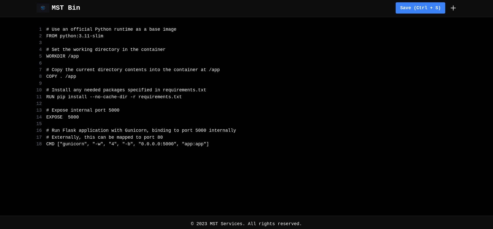
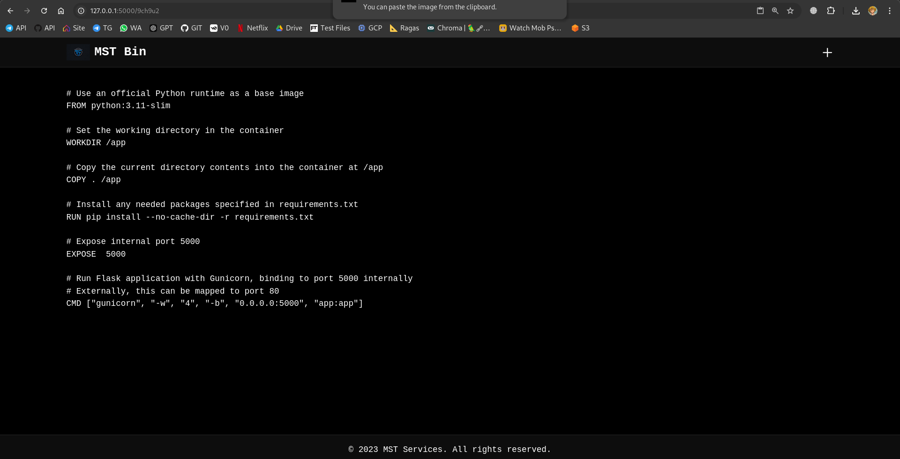

# MST Bin - Modern Pastebin Clone

MST Bin is a modern, feature-rich pastebin clone that allows users to share text snippets with automatic 24-hour expiration. Built with Flask and MongoDB, it features a sleek dark theme interface with line numbers and keyboard shortcuts.

## Screenshots

### Homepage

*Homepage with dark theme and line numbers*

### Paste View

*Individual paste view with syntax highlighting*

## Features

- 🌙 Dark theme interface
- 📝 Line numbers
- ⌨️ Keyboard shortcuts (Ctrl + S to save)
- 🔄 Automatic URL copying when viewing pastes
- ⏰ 24-hour automatic expiration
- 🎨 Glassmorphism design
- 📱 Responsive layout

## Prerequisites

- Python 3.8+
- MongoDB
- Docker (optional)

## Environment Variables

Create a `.env` file in the root directory with the following variables:

```env
MONGO_CONNECTION_STRING=your_mongodb_connection_string
MONGO_DB_NAME=pastebin
MONGO_COLLECTION_NAME=pastes
KEY_LENGTH=6
EXPIRATION_HOURS=24
FLASK_DEBUG=False
FLASK_PORT=5000
FLASK_HOST=0.0.0.0
```

## Deployment
- Deploy using Docker,Docker Compose 